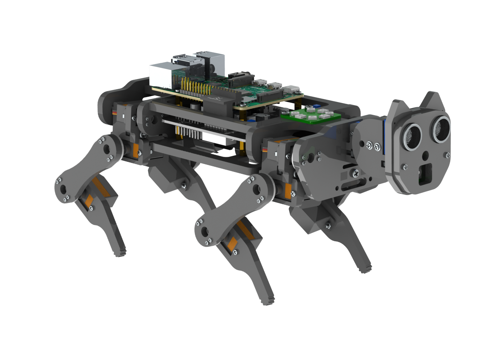

## Freenove Robot Dog Kit for Raspberry Pi

> A Robot Dog Kit for Raspberry Pi.

### Abstract
This project aims to extend the existing Freenove robot code to enable full-body cat detection using computer vision, with the goal of making the robot capable of autonomously detecting and pursuing cats. By integrating a vision system and an ultrasonic sensor, the robot will be able to identify cats in its environment and track them effectively, allowing for real-time interaction and movement based on the detected position and distance of the target.
